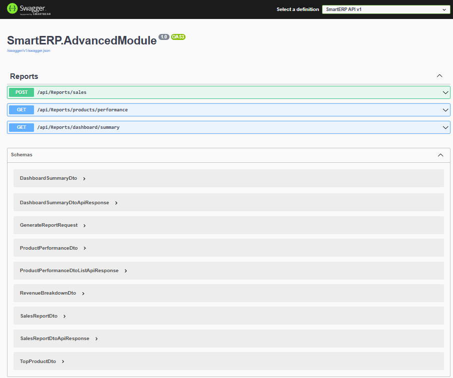

# SmartERP - Sistem Manajemen Bisnis Kostum

> Sistem ERP komprehensif yang saya kembangkan untuk mengelola bisnis rental dan penjualan kostum secara terintegrasi

    


*Dashboard utama dengan metrik bisnis real-time*

---

## Tentang Proyek

SmartERP adalah sistem yang saya bangun dari nol untuk mengatasi tantangan spesifik dalam bisnis kostum. Sistem ini dirancang untuk menangani dua model bisnis sekaligus: penjualan dan penyewaan kostum, dengan manajemen inventory yang otomatis.

**Motivasi Pengembangan:**
- Memahami kompleksitas bisnis retail dan rental secara mendalam
- Mendemonstrasikan kemampuan pengembangan full-stack dengan berbagai teknologi
- Mengimplementasikan arsitektur multi-modul dalam satu ekosistem terpadu
- Menunjukkan kemampuan development dengan Laravel untuk operasional dan .NET untuk analytics

---

## Arsitektur Dual Backend

Proyek ini menggunakan pendekatan **arsitektur dual backend** yang memisahkan fungsi berdasarkan kebutuhan:

```
┌─────────────────────────────────────────┐
│         Frontend (Vue.js 3)             │
│   - Antarmuka Pengguna                  │
│   - Manajemen State                     │
└──────────────┬──────────────────────────┘
               │
       ┌───────┴────────┐
       ▼                ▼
┌──────────────┐  ┌─────────────────────┐
│   Laravel    │  │   ASP.NET Core C#   │
│   Backend    │  │   Modul Analytics   │
│              │  │                     │
│ - CRUD       │  │ - Laporan           │
│ - Auth       │  │ - Analytics         │
│ - Bisnis     │  │ - Dashboard BI      │
└──────┬───────┘  └──────────┬──────────┘
       │                     │
       ▼                     ▼
  ┌─────────┐         ┌──────────────┐
  │  MySQL  │         │ SQL Server   │
  └─────────┘         └──────────────┘
```

**Alasan Dual Backend:**
1. **Pemisahan Fungsi** - Operasi CRUD terpisah dari pemrosesan analytics
2. **Demonstrasi Teknologi** - Menunjukkan kemampuan penggunaan berbagai teknologi
3. **Skalabilitas** - Setiap backend dapat dikembangkan secara independen
4. **Optimasi Performa** - Laravel sangat baik untuk CRUD cepat, sementara .NET C# dengan SQL Server lebih kuat untuk analytics kompleks dan komputasi berat
5. **Arsitektur Dunia Nyata** - Banyak perusahaan enterprise menggunakan pendekatan microservices dengan berbagai teknologi sesuai kebutuhan masing-masing modul

---

## Teknologi yang Digunakan

### Frontend
- **Vue.js 3** - Composition API dan Options API
- **Tailwind CSS** - Styling berbasis utility
- **Vue Router** - Routing di sisi client
- **Axios** - HTTP client untuk integrasi API

### Backend #1: Laravel (Operasi Utama)
- **Laravel 10** - Arsitektur REST API
- **MySQL 8.0** - Database relasional
- **JWT Authentication** - Autentikasi berbasis token
- **Queue System** - Pemrosesan pekerjaan di background

### Backend #2: ASP.NET Core (Modul Analytics) 
- **ASP.NET Core 8.0** - Framework web modern
- **C# 12** - Fitur bahasa terbaru dengan LINQ
- **Entity Framework Core 8.0** - ORM dengan pendekatan code-first
- **SQL Server 2022 Express** - Database tingkat enterprise
- **Swagger/OpenAPI** - Dokumentasi API interaktif

### Alat Development
- **Git** - Version control
- **Vite** - Build tool untuk frontend
- **Postman** - Testing API
- **Visual Studio Code** - IDE utama

---

## Fitur Utama

### 1. Manajemen Produk


Mengelola katalog kostum dengan informasi lengkap: material, ukuran, warna, dan supplier. Sistem mendukung dual pricing (harga jual dan sewa per hari) serta tracking stok otomatis dengan notifikasi low stock alert.

**Kemampuan:**
- Operasi CRUD dengan validasi
- Filter berdasarkan kategori, material, dan ukuran
- Fitur pencarian real-time
- Peringatan stok rendah otomatis (≤10 item)
- Sistem harga ganda untuk penjualan dan sewa
- Perhitungan margin keuntungan

### 2. Sistem Transaksi


Menangani penjualan dan penyewaan dalam satu antarmuka terpadu. Stok inventory berkurang otomatis setelah transaksi, dengan dukungan untuk berbagai metode pembayaran.

**Fitur:**
- Dukungan untuk transaksi penjualan dan sewa
- Pengurangan stok otomatis
- Berbagai metode pembayaran (Cash, Transfer, E-wallet)
- Tracking profil customer
- Riwayat transaksi lengkap
- Analisa revenue per tipe transaksi

### 3. Dashboard Real-time

Dashboard yang menampilkan metrik bisnis secara real-time: total revenue, jumlah transaksi, status stok produk, sampai kehadiran karyawan. Dilengkapi dengan insights AI yang memberikan rekomendasi berdasarkan data historis.

**Metrik Utama:**
- Total revenue dengan tingkat pertumbuhan
- Jumlah transaksi (breakdown penjualan vs sewa)
- Status inventory produk
- Tingkat kehadiran karyawan
- Rekomendasi bisnis berbasis AI

### 4. Manajemen Karyawan


Database karyawan lengkap dengan tracking kehadiran harian. Dapat memonitor performa dan menghasilkan laporan bulanan.

### 5. Tracking Kehadiran


Sistem absensi untuk tracking kehadiran karyawan dengan berbagai status (hadir, tidak hadir, sakit, cuti). Perhitungan otomatis untuk tingkat kehadiran.

### 6. Feedback Pelanggan


Sistem untuk menangkap feedback pelanggan dalam rangka perbaikan berkelanjutan. Termasuk rating, komentar, dan tindak lanjut.

### 7. Sistem Tiket


Menangani komplain dan pertanyaan customer dengan tracking status lengkap (terbuka, dalam proses, terselesaikan).

---

## Modul Analytics (ASP.NET Core C#) 

### Mengapa Pakai .NET untuk Analytics?

Saya mengembangkan modul analytics terpisah dengan ASP.NET Core dan SQL Server karena beberapa alasan teknis:

**1. Performa untuk Query Kompleks**
- SQL Server lebih optimal untuk query analitik dengan dataset besar
- LINQ to SQL menghasilkan query yang lebih efisien dibanding Eloquent untuk aggregation
- Pattern async/await di C# memberikan performa lebih baik untuk operasi I/O

**2. Keamanan Tipe Data & Pengecekan Compile-Time**
- C# adalah bahasa strongly-typed, mengurangi error saat runtime
- Pengecekan compile-time untuk menangkap bug lebih awal
- IntelliSense yang lebih kuat untuk kecepatan development

**3. Analytics Tingkat Enterprise**
- SQL Server punya fitur advanced untuk business intelligence (indexed views, computed columns, window functions)
- Ekosistem .NET punya library yang kuat untuk pemrosesan data dan perhitungan statistik
- Manajemen memori yang lebih baik untuk menangani dataset besar

**4. Pertimbangan Skalabilitas**
- Modul analytics bisa di-deploy secara terpisah
- Dapat di-scale independently sesuai beban pemrosesan
- Tidak berdampak pada performa operasi CRUD utama

**5. Demonstrasi Kemampuan**
- Menunjukkan fleksibilitas dalam berbagai teknologi
- Pemahaman tentang memilih alat yang tepat untuk masalah spesifik
- Pendekatan arsitektur microservices dunia nyata

### Arsitektur

Modul analytics dibangun dengan pola clean architecture:

```
Controllers (Layer API)
    ↓
Services (Logika Bisnis)
    ↓
Data Access (EF Core)
    ↓
SQL Server Database
```

### Endpoint API

**Laporan & Analytics Advanced:**

```
POST   /api/reports/sales
       Generate laporan penjualan komprehensif dengan analisa pertumbuhan
       
GET    /api/reports/products/performance
       Tracking performa produk dengan sistem rating
       
GET    /api/reports/dashboard/summary
       Metrik dashboard real-time untuk business intelligence
```

### Format Response

Semua endpoint menggunakan format response yang terstandarisasi:

```json
{
  "success": true,
  "message": "Operasi berhasil",
  "data": { ... },
  "timestamp": "2024-10-23T..."
}
```

### Contoh Laporan Penjualan

```json
{
  "success": true,
  "message": "Laporan penjualan berhasil dibuat",
  "data": {
    "reportDate": "2024-10-23T...",
    "period": "monthly",
    "totalRevenue": 15000000,
    "totalSales": 8000000,
    "totalRentals": 7000000,
    "transactionCount": 245,
    "growthRate": 15.5,
    "topProducts": [
      {
        "productName": "Kostum Tradisional",
        "quantitySold": 45,
        "revenue": 5000000
      }
    ],
    "revenueBreakdown": {
      "salesRevenue": 8000000,
      "rentalRevenue": 7000000,
      "paymentMethodBreakdown": {
        "Cash": 6000000,
        "Transfer": 5000000,
        "E-Wallet": 4000000
      }
    }
  }
}
```

### Tracking Performa Produk

```json
{
  "success": true,
  "message": "Data performa untuk 2 produk berhasil diambil",
  "data": [
    {
      "productId": 1,
      "productName": "Kostum Tradisional - Kebaya",
      "sku": "TRAD-001",
      "totalQuantitySold": 45,
      "totalRevenue": 5000000,
      "totalTransactions": 32,
      "averagePrice": 156250,
      "performanceRating": "Excellent",
      "lastSoldDate": "2024-10-20"
    }
  ]
}
```

### Contoh Kode Berkualitas

**Dependency Injection:**
```csharp
public class ReportService : IReportService
{
    private readonly ApplicationDbContext _context;
    private readonly ILogger<ReportService> _logger;
    
    public ReportService(ApplicationDbContext context, ILogger<ReportService> logger)
    {
        _context = context;
        _logger = logger;
    }
}
```

**Pattern Async/Await:**
```csharp
public async Task<SalesReportDto> GenerateSalesReportAsync(DateTime startDate, DateTime endDate)
{
    var transactions = await _context.Transactions
        .Where(t => t.CreatedAt >= startDate && t.CreatedAt <= endDate)
        .Include(t => t.Product)
        .ToListAsync();
    
    // Pemrosesan logika bisnis...
    return reportDto;
}
```

**Query LINQ:**
```csharp
var topProducts = transactions
    .GroupBy(t => new { t.ProductId, t.Product.Name })
    .Select(g => new TopProductDto
    {
        ProductName = g.Key.Name,
        QuantitySold = g.Sum(t => t.Quantity),
        Revenue = g.Sum(t => t.Total)
    })
    .OrderByDescending(p => p.Revenue)
    .Take(5);
```

---

## Alur Data Arsitektur

```
Aksi User (Komponen Vue)
    ↓
HTTP Request (Axios)
    ↓
┌─────────────────────────┐
│  Laravel API            │ ← Untuk operasi CRUD
│  (localhost:8000)       │
│  ↓                      │
│  MySQL Database         │
└─────────────────────────┘

    ATAU

┌─────────────────────────┐
│  ASP.NET Core API       │ ← Untuk analytics
│  (localhost:5103)       │
│  ↓                      │
│  SQL Server Database    │
└─────────────────────────┘
    ↓
JSON Response
    ↓
Sistem Reaktivitas Vue
    ↓
Update UI
```

---

## Setup & Instalasi

### Kebutuhan Sistem
- Node.js 18+
- PHP 8.1+
- MySQL 8.0+
- Composer
- .NET 8 SDK
- SQL Server 2022 Express

### Setup Frontend

```bash
# Clone repository
git clone [repo-url]
cd proyek-portofolio-app/frontend

# Install dependencies
npm install

# Jalankan development server
npm run dev
```

### Setup Laravel Backend

```bash
cd smart-erp-backend

# Install dependencies
composer install

# Konfigurasi environment
cp .env.example .env
php artisan key:generate

# Setup database
php artisan migrate
php artisan db:seed

# Jalankan server
php artisan serve
```

### Setup Modul Analytics .NET

```bash
cd smarterp-dotnet-module/SmartERP.AdvancedModule

# Restore packages
dotnet restore

# Update connection string di appsettings.json
# Server=localhost\\SQLEXPRESS;Database=SmartERP_Analytics;Integrated Security=true;

# Jalankan migrations
dotnet ef database update

# Jalankan aplikasi
dotnet run --launch-profile http
```

Akses Swagger UI di: `http://localhost:5103`

---

## Logika Bisnis

### Perhitungan Transaksi

**Penjualan:**
```
Total = Harga × Kuantitas
```

**Sewa:**
```
Total = Harga Sewa × Kuantitas × Jumlah Hari
```

### Manajemen Stok Otomatis

```javascript
// Saat Pembuatan Transaksi
stok_sekarang = stok_sekarang - kuantitas

// Saat Pembatalan Transaksi
stok_sekarang = stok_sekarang + kuantitas

// Peringatan Stok Rendah
if (stok_sekarang <= 10) {
    trigger_notifikasi()
}
```

### Perhitungan Margin Keuntungan

```
Profit = (Harga Jual - Biaya) × Kuantitas
Margin = ((Harga Jual - Biaya) / Harga Jual) × 100%
```

---

## Keunggulan Sistem

### 1. Spesifik untuk Bisnis Kostum
- Model harga ganda (penjualan & sewa)
- Tracking detail untuk material dan ukuran
- Kategori komprehensif (tradisional, modern, anak-anak, pertunjukan)

### 2. Siap Produksi
- Penanganan error menyeluruh di semua layer
- Validasi input dengan pesan error yang jelas
- Desain responsif untuk berbagai perangkat
- Optimasi performa dengan lazy loading

### 3. Arsitektur yang Dapat Dikembangkan
- Struktur komponen modular
- Desain REST API
- Pendekatan database-agnostic dengan ORM
- Mudah untuk menambah modul baru

### 4. Praktik Development Modern
- Vue 3 Composition API
- Laravel 10 best practices
- ASP.NET Core clean architecture
- Optimasi query SQL Server
- Tailwind utility-first CSS

### 5. Nilai Bisnis Nyata
- Manajemen inventory otomatis
- Dukungan berbagai metode pembayaran
- Tracking pelanggan komprehensif
- Analytics dan reporting advanced
- Business insights berbasis AI

---

## Tantangan & Solusi

### Tantangan #1: Model Bisnis Ganda
**Masalah:** Mengelola penjualan dan rental dalam satu sistem tanpa membuat kompleksitas berlebihan.

**Solusi:** Implementasi flag tipe transaksi dengan logika conditional yang fleksibel. Aturan bisnis terpisah untuk setiap tipe transaksi namun tetap dalam satu alur kerja.

### Tantangan #2: Sinkronisasi Stok Real-time
**Masalah:** Stok harus update secara konsisten di semua modul secara real-time.

**Solusi:** Arsitektur event-driven dengan localStorage sync untuk frontend dan integrasi API dengan update berbasis transaksi di backend.

### Tantangan #3: Pemrosesan Analytics Kompleks
**Masalah:** Generate laporan kompleks dengan kalkulasi berat tanpa berdampak pada performa.

**Solusi:** Backend analytics dedicated dengan ASP.NET Core dan SQL Server untuk menangani query kompleks secara efisien dengan optimasi LINQ.

### Tantangan #4: Pengalaman Pengguna
**Masalah:** Antarmuka harus intuitif untuk pengguna yang tidak teknis.

**Solusi:** Desain bersih dengan Tailwind, informasi yang jelas dan terstruktur, penanganan error yang ramah pengguna dengan pesan yang dapat ditindaklanjuti.

---

## Screenshot Lengkap

### Dashboard & Overview

*Metrik bisnis real-time dengan insights AI*

### Katalog Produk

*Grid produk dengan filtering advanced*

### Manajemen Transaksi

*Riwayat transaksi dengan statistik komprehensif*

### Database Karyawan

*Manajemen karyawan dengan profil detail*

### Sistem Kehadiran

*Tracking kehadiran harian*

### Feedback Pelanggan

*Manajemen rating dan feedback*

### Tiket Support

*Sistem tiket customer support*

### Analytics API (Swagger)

*Dokumentasi API interaktif untuk modul analytics*

---

## Standar Development

### Prinsip Kualitas Kode
- **Single Responsibility Principle** - Setiap class/function punya satu tujuan
- **DRY (Don't Repeat Yourself)** - Komponen dan fungsi yang dapat digunakan ulang
- **Penamaan yang Bermakna** - Nama variable dan function yang deskriptif
- **Dokumentasi Komprehensif** - Komentar inline untuk logika kompleks
- **Penanganan Error** - Blok try-catch di setiap operasi kritis
- **Validasi Input** - Di frontend dan backend
- **Type Safety** - Persiapan untuk migrasi TypeScript

### Skenario Testing
- Operasi CRUD untuk semua modul
- Alur transaksi (penjualan & sewa)
- Konsistensi update stok
- Edge cases (stok habis, input tidak valid)
- Skenario concurrent user
- Benchmark response time API
- Optimasi query database
- Kompatibilitas cross-browser

---

## Metrik Performa

Hasil testing di environment development:

**Frontend:**
- Waktu Load Halaman: < 2 detik (first load)
- Ukuran Bundle: ~180KB (gzipped)
- Skor Lighthouse: 95+ (Performa, Aksesibilitas)

**Laravel Backend:**
- Response API: < 300ms rata-rata
- Query Database: Dioptimasi dengan indexing
- Concurrent Users: Tested hingga 50 request simultan

**Modul Analytics .NET:**
- Dashboard Summary: < 200ms
- Performa Produk: < 300ms
- Generate Laporan Penjualan: < 500ms
- Database: SQL Server dengan indexed queries

---

## Implementasi Keamanan

### Langkah yang Diimplementasikan
- Sanitasi input di semua form
- Pencegahan SQL injection (Laravel Eloquent & EF Core ORM)
- Proteksi XSS dengan output escaping
- Autentikasi JWT token dengan expiry
- Password hashing menggunakan bcrypt
- Konfigurasi CORS untuk kontrol akses API
- Rate limiting untuk mencegah abuse
- Konfigurasi secure HTTP headers

---

## Siap Deploy

Sistem ini siap untuk deploy ke berbagai environment:

**Development:**
- Hot-reload untuk rapid development
- Mode debug aktif
- Pesan error detail

**Staging:**
- Testing environment di cloud
- Konfigurasi mirip production
- Monitoring performa

**Production:**
- Build teroptimasi
- Error logging ke layanan eksternal
- Otomasi backup database
- CDN untuk static assets
- Siap load balancing

Konfigurasi environment sudah proper dengan file `.env` terpisah untuk setiap environment.

---

## Pengembangan Selanjutnya

### Fase 2 (Direncanakan)
- [ ] Integrasi notifikasi WhatsApp untuk update customer
- [ ] Sistem QR code untuk tracking produk
- [ ] Laporan advanced dengan export PDF/Excel
- [ ] Integrasi payment gateway (Midtrans, Xendit)
- [ ] Barcode scanning untuk inventory
- [ ] Dukungan multi-warehouse

### Fase 3 (Roadmap)
- [ ] Aplikasi mobile (React Native)
- [ ] E-commerce storefront untuk pemesanan online
- [ ] Otomasi email marketing
- [ ] Prediksi AI advanced dan rekomendasi
- [ ] Dukungan multi-bahasa (ID/EN)
- [ ] Modul manajemen franchise

---

## Dokumentasi

Untuk dokumentasi lebih detail:
- **Dokumentasi API**: Swagger UI di `http://localhost:5103`
- **Skema Database**: Diagram ER tersedia di `/database/schema.png`
- **Dokumentasi Kode**: Komentar inline di setiap file
- **Panduan Setup**: Step-by-step di README ini

---

## Kontak & Kolaborasi

Saya terbuka untuk diskusi teknis, feedback, atau kolaborasi dalam proyek serupa.

**Email**: erlinanainggolan130104@gmail.com  
**GitHub**: [https://github.com/Erlina130104/proyek-portofolio-app]  
**Telepon**: +62 897-1798-041

---

## Catatan untuk Reviewer Teknis

Sistem ini dikembangkan dengan fokus pada:

**Kode Bersih:**
- Mudah dibaca dan di-maintain
- Dokumentasi baik dengan komentar inline
- Konsistensi konvensi penamaan

**Best Practices:**
- Konvensi framework Laravel
- Pattern composition Vue.js
- Clean architecture ASP.NET Core
- Standar REST API

**Skalabilitas:**
- Arsitektur modular
- Normalisasi database
- Optimasi query efisien
- Strategi caching

**Siap Produksi:**
- Testing komprehensif
- Penanganan error di semua layer
- Implementasi langkah keamanan
- Performa teroptimasi

Siap untuk deployment produksi dan continuous improvement berdasarkan feedback pengguna dan kebutuhan bisnis.

---

**Dibuat dengan ❤️ oleh Erlina Nainggolan**

*Terakhir Diupdate: Oktober 2024*